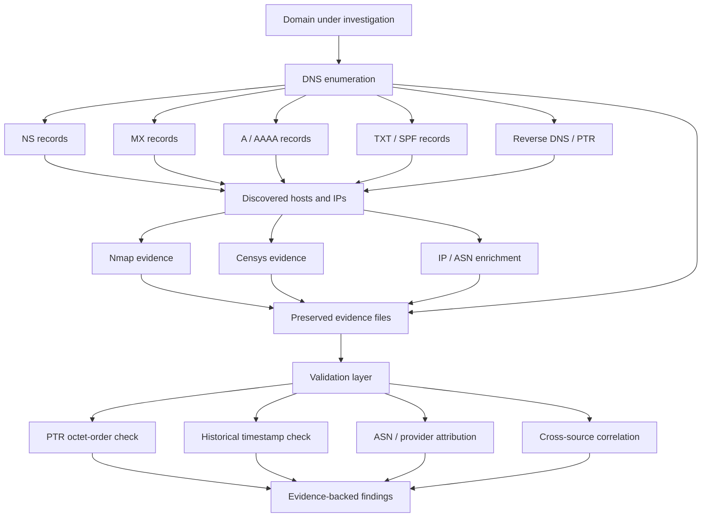

# DNS-domain_analyzer

### Evidence-first DNS, domain, IP, and infrastructure reconnaissance research


> **Scope:** `DNS-domain_analyzer` is a defensive research repository for preserving and interpreting DNS, reverse-DNS, IP-attribution, Nmap, and Censys evidence associated with domains under investigation. The project deliberately separates **what the raw data shows** from **what that data may mean**.

The repository currently contains historical evidence sets centered on `hideouts.io` and `slnr.com`.

---

## Table of Contents

- [Overview](#overview)
- [Executive Summary](#executive-summary)
- [What This Repository Is](#what-this-repository-is)
- [Research Architecture](#research-architecture)
- [Evidence Classification](#evidence-classification)
- [Case Study: hideouts.io](#case-study-hideoutsio)
- [Critical Finding: PTR Octet Reversal](#critical-finding-ptr-octet-reversal)
- [Case Study: slnr.com](#case-study-slnrcom)
- [Historical `compute.lax1.slnr.com` Observation](#historical-computelax1slnrcom-observation)
- [What DNS Can and Cannot Prove](#what-dns-can-and-cannot-prove)
- [Investigation Workflow](#investigation-workflow)
- [Manual Reproduction](#manual-reproduction)
- [Nmap Evidence](#nmap-evidence)
- [Censys Evidence](#censys-evidence)
- [IP Attribution](#ip-attribution)
- [Evidence and Provenance](#evidence-and-provenance)
- [Repository Structure](#repository-structure)
- [Interpretation Boundaries](#interpretation-boundaries)
- [Research Questions](#research-questions)
- [Future Work](#future-work)
- [Responsible Use](#responsible-use)
- [Conclusion](#conclusion)

---

## Overview

`DNS-domain_analyzer` is an evidence archive and research project for investigating the infrastructure surrounding a domain.

The repository combines several kinds of observations:

- authoritative DNS servers;
- MX infrastructure;
- A/AAAA resolution;
- reverse DNS / PTR information;
- SPF-discovered networks;
- Nmap host discovery;
- Nmap service fingerprints;
- IP ownership and geolocation enrichment;
- Censys host observations;
- historical notes about unexpected domain appearances.

The guiding principle is simple:

> **A DNS relationship is an observation, not attribution by itself.**

A hostname resolving to an IP does not automatically prove that the IP owner controls the domain. A provider ASN does not establish the identity of the customer using that provider. A PTR name does not prove application ownership. A cloud endpoint does not prove compromise.

This repository is intended to preserve enough raw evidence to test those distinctions.

---

## Executive Summary

### Current evidence sets

The repository contains historical reconnaissance data for two primary cases:

1. **`hideouts.io`**
   - Google-hosted authoritative DNS was observed.
   - Google mail infrastructure was observed.
   - SPF and related infrastructure discovery produced a large set of Google-associated networks.
   - Nmap output and IP-enrichment results were preserved.
   - A previous interpretation suggested Department of Defense involvement.
   - Re-analysis of the checked-in evidence shows that the apparent DoD addresses can be explained by **reverse-DNS octet reversal**, not by evidence that the domain was taken over by the DoD.

2. **`slnr.com`**
   - GoDaddy-hosted authoritative DNS and mail infrastructure were observed in the historical scan.
   - `www.slnr.com` resolved to `15.197.225.128` and `3.33.251.168` in the preserved scan.
   - Nmap identified an `awselb/2.0` HTTP response on the observed web infrastructure and HTTPS on TCP/443.
   - Historical research notes reported seeing names under `*.compute.lax1.slnr.com` during broader device/network investigation.
   - The currently checked-in repository evidence does **not by itself** establish that those names appeared on every device or prove why they appeared.

### The most important analytical finding

The repository demonstrates a useful DNS-forensics pitfall:

```text
108.177.104.26
        |
        | reverse DNS representation
        v
26.104.177.108.in-addr.arpa
```

If the octets from the `.in-addr.arpa` name are incorrectly read left-to-right as a normal IPv4 address, the result becomes:

```text
26.104.177.108
```

That is a **different IP address**.

Provider attribution performed on that incorrectly reconstructed address can produce a completely unrelated organization and create a dramatic but false conclusion.

---

## What This Repository Is

At present, this repository is primarily a **research and evidence archive**, not a self-contained scanning application.

It preserves output produced by domain-analysis, DNS, Nmap, IP-enrichment, and Censys workflows.

The project is useful for:

- reviewing historical reconnaissance;
- correlating DNS and network observations;
- studying hosting-provider relationships;
- identifying parser and attribution mistakes;
- separating infrastructure ownership from domain ownership;
- documenting unusual endpoint observations;
- building reproducible security-research cases.

It should not be interpreted as an automated verdict engine.

```text
RAW OBSERVATION != ATTRIBUTION != CONCLUSION
```

---

## Research Architecture



The validation layer is important because infrastructure reconnaissance commonly crosses abstraction boundaries:

```text
Domain
  -> DNS record
  -> IP address
  -> ASN
  -> hosting provider
  -> service fingerprint
  -> possible customer
```

Every arrow introduces an opportunity for over-attribution.

---

## Evidence Classification

Findings in this project should be classified explicitly.

| Classification | Meaning |
|---|---|
| **Direct observation** | Present in the checked-in DNS, Nmap, Censys, or enrichment output. |
| **Derived observation** | Computed from direct evidence, such as ASN/provider lookup. |
| **Documented capability** | A capability of DNS, Nmap, Censys, AWS, Google, GoDaddy, or another identified provider. |
| **Technically plausible** | Consistent with the evidence but not uniquely established by it. |
| **Speculative** | A hypothesis requiring additional evidence. |
| **Unsupported** | The available evidence does not establish the claim. |

Example:

| Type | Statement |
|---|---|
| **Direct observation** | Historical `www.slnr.com` scanning reached `15.197.225.128` and `3.33.251.168`. |
| **Direct observation** | Nmap returned an `awselb/2.0` HTTP server header. |
| **Technically plausible** | The web endpoint used AWS front-end infrastructure. |
| **Unsupported from current files alone** | Every device was intentionally routed through `slnr.com`. |
| **Unsupported** | A surprising ASN result proves domain takeover. |

---

# Case Study: hideouts.io

The historical `hideouts.io` domain-analysis output contains several useful observations.

## Authoritative DNS

The preserved scan identified Google-hosted nameservers including:

```text
ns-cloud-b1.googledomains.com
ns-cloud-b2.googledomains.com
ns-cloud-b3.googledomains.com
ns-cloud-b4.googledomains.com
```

That supports the limited conclusion that the domain's authoritative DNS was using Google infrastructure at the time of the scan.

It does **not** identify every service behind the domain.

## Mail infrastructure

The scan also identified Google mail exchangers such as:

```text
aspmx.l.google.com
alt1.aspmx.l.google.com
alt2.aspmx.l.google.com
alt3.aspmx.l.google.com
alt4.aspmx.l.google.com
```

Again, this is consistent with Google-hosted mail service.

## Zone transfer

The historical scan reports that no DNS zone transfer was obtained from the tested nameservers.

That is useful negative evidence:

```text
AXFR tested
    |
    v
No zone transfer observed
```

It should not be generalized into a permanent statement about the domain because DNS configuration can change over time.

## SPF expansion

The stored output expanded SPF-related infrastructure and recorded multiple Google-associated network ranges.

This type of discovery can create a very large infrastructure graph because an SPF include may reference provider-wide networks rather than machines dedicated exclusively to one domain.

Therefore:

> **An IP discovered through SPF is not automatically a server controlled by the investigated domain.**

---

# Critical Finding: PTR Octet Reversal

The original README stated that `hideouts.io` had been partly taken over by the Department of Defense based on scan and resolved-IP results.

The checked-in evidence does not support that conclusion.

Instead, the evidence exposes a classic reverse-DNS parsing problem.

## How IPv4 reverse DNS works

For the IPv4 address:

```text
108.177.104.26
```

its reverse-DNS lookup name is constructed by reversing the octets:

```text
26.104.177.108.in-addr.arpa
```

That does **not** mean the address is:

```text
26.104.177.108
```

The correct address remains:

```text
108.177.104.26
```

## Why this matters here

The raw `hideouts.io` scan records Google MX infrastructure and shows PTR-style values such as:

```text
26.104.177.108.in-addr.arpa
26.113.253.172.in-addr.arpa
```

Those correspond to addresses in normal order such as:

```text
108.177.104.26
172.253.113.26
```

The separate IP-enrichment output contains lookups for:

```text
26.104.177.108
26.113.253.172
```

Those are the reversed-octet forms.

Because those reversed values happen to fall into unrelated address space, enrichment can return an unrelated organization—in this case records labeled with the DoD Network Information Center.

The attribution chain becomes:

```text
Google MX IP
   |
   v
PTR representation
   |
   v
Octets accidentally kept reversed
   |
   v
Different IPv4 address
   |
   v
Unrelated ASN lookup
   |
   v
False organizational attribution
```

### Correct interpretation

**Direct observation:** DoD-attributed IPs appear in the enrichment output.

**Root cause supported by the repository:** those values match reversed octets extracted from `.in-addr.arpa` names associated with other infrastructure.

**Not supported:** that the Department of Defense took control of `hideouts.io`.

This is exactly the kind of result the project should preserve because it demonstrates why DNS-forensics tooling must retain record type and directionality.

---

# Case Study: slnr.com

The historical `slnr.com` evidence contains a different infrastructure pattern.

## Authoritative DNS

The scan identified:

```text
ns19.domaincontrol.com
ns20.domaincontrol.com
```

These names are consistent with GoDaddy-hosted DNS infrastructure.

## Mail infrastructure

The scan identified mail servers including:

```text
smtp.secureserver.net
mailstore1.secureserver.net
```

These are provider-hosted mail endpoints and should not be treated as dedicated `slnr.com` machines.

## Historical web resolution

The checked-in scan recorded `www.slnr.com` at:

```text
15.197.225.128
3.33.251.168
```

The accompanying Nmap output identified TCP/80 and TCP/443 on the discovered web infrastructure.

For TCP/80, Nmap recorded:

```text
Server: awselb/2.0
```

and HTTP responses including:

```text
403 Forbidden
400 Bad Request
```

This is strong evidence that the observed historical endpoint was using AWS-style load-balancing/front-end infrastructure.

It does **not** establish:

- who the AWS customer was;
- why a particular client contacted the hostname;
- whether the service was malicious;
- whether the endpoint was dedicated to `slnr.com`;
- whether the same infrastructure is still in use today.

---

# Historical `compute.lax1.slnr.com` Observation

A prior research note associated with this repository reported that `slnr.com` appeared repeatedly during advanced DNS reconnaissance, particularly names matching a pattern similar to:

```text
*.compute.lax1.slnr.com
```

That is an interesting lead, but it should be classified correctly.

### Current evidence status

| Question | Status |
|---|---|
| Does the repo contain historical `slnr.com` DNS/Nmap evidence? | **Yes** |
| Does the repo show AWS-style web infrastructure for historical `www.slnr.com`? | **Yes** |
| Do the currently checked-in files independently prove `*.compute.lax1.slnr.com` appeared on every device? | **No** |
| Do the current files establish what application or service generated those observations? | **No** |
| Is the pattern worth investigating with packet captures, DNS logs, or endpoint process correlation? | **Yes** |

To elevate this observation from a research note to a demonstrated finding, preserve evidence such as:

```text
Timestamp
Device identifier
DNS query
DNS response
Resolver used
Source process if available
Destination IP
TLS SNI / certificate metadata if visible
Packet-capture reference
```

A repeated hostname across devices becomes significantly more meaningful when the process, timestamp, resolver, and response chain are also preserved.

---

# What DNS Can and Cannot Prove

DNS is extremely useful, but it is easy to over-read.

## DNS can directly show

- which nameservers answered;
- which record values were returned;
- which MX servers were configured;
- which A/AAAA addresses were returned;
- which TXT/SPF values existed;
- which CNAME chain was visible;
- which PTR name was returned for an IP;
- TTL values and response metadata when preserved.

## DNS alone usually cannot prove

- the human or organization operating an application;
- the customer behind shared cloud infrastructure;
- malicious intent;
- compromise;
- surveillance;
- data exfiltration;
- that a returned IP is dedicated to one domain;
- that an ASN owner controls the domain;
- that a reverse-DNS name identifies the connecting application.

A useful mental model is:

```text
Domain ownership
      !=
DNS hosting
      !=
IP ownership
      !=
Cloud customer
      !=
Application operator
```

Sometimes those identities overlap. Often they do not.

---

# Investigation Workflow

A disciplined investigation should progress from least interpretive evidence to more interpretive enrichment.

```text
1. Preserve the hostname exactly
          |
          v
2. Query DNS records
          |
          v
3. Preserve raw resolver output
          |
          v
4. Resolve A / AAAA / CNAME
          |
          v
5. Perform PTR lookup correctly
          |
          v
6. Attribute IP -> ASN / provider
          |
          v
7. Check passive services / Censys
          |
          v
8. Perform authorized active scanning
          |
          v
9. Correlate with packet / endpoint evidence
          |
          v
10. Form a bounded conclusion
```

The order matters.

If provider attribution occurs before the DNS record type and octet order are validated, false conclusions become much easier.

---

# Manual Reproduction

The following commands are useful for domains you own or are authorized to research.

## Basic records

```bash
dig example.com A
dig example.com AAAA
dig example.com NS
dig example.com MX
dig example.com TXT
```

## Trace delegation

```bash
dig +trace example.com
```

## Query a specific resolver

```bash
dig @1.1.1.1 example.com A
dig @8.8.8.8 example.com A
```

Different resolvers may return different answers because of:

- CDN steering;
- geolocation;
- ECS behavior;
- caching;
- split DNS;
- resolver policy;
- DNS load balancing.

## Reverse DNS

For an address such as:

```text
108.177.104.26
```

use:

```bash
dig -x 108.177.104.26
```

Do **not** manually reinterpret the resulting `.in-addr.arpa` label as a forward-order IP address.

## Preserve timestamps

```bash
date -u

dig example.com A +noall +answer
```

DNS changes. A result without a timestamp is much weaker forensic evidence.

---

# Nmap Evidence

The repository contains Nmap output in multiple standard formats, including files such as:

```text
*.nmap
*.gnmap
*.xml
```

These are useful because they preserve different levels of detail.

### Human-readable Nmap output

```text
.nmap
```

Useful for reviewing:

- open ports;
- service detection;
- banners;
- script output;
- traceroute information.

### Greppable output

```text
.gnmap
```

Useful for quick filtering and historical comparison.

### XML output

```text
.xml
```

Useful for structured parsing and future automation.

## Important limitation

An Nmap service fingerprint is evidence about how a network endpoint responded during a particular scan.

For example:

```text
awselb/2.0
```

supports infrastructure attribution to an AWS-style HTTP front end, but does not identify the end customer or explain why a device reached that endpoint.

---

# Censys Evidence

The `slnr.com/Censys/` directory preserves host-oriented Censys results for multiple IP addresses examined during the investigation.

Censys can provide historical or observed information such as:

- open services;
- certificate metadata;
- HTTP fingerprints;
- protocol banners;
- ASN/provider information;
- observed host characteristics.

Treat Censys as an additional evidence source rather than ground truth.

```text
DNS observation
      +
Nmap observation
      +
Censys observation
      +
ASN attribution
      =
Stronger correlation
```

Even multiple sources do not automatically establish application ownership.

---

# IP Attribution

IP-enrichment data can be useful for identifying:

- ASN;
- network operator;
- approximate geography;
- reverse hostname;
- cloud/provider ownership.

It is also one of the easiest places to over-attribute.

## Provider ownership vs. customer ownership

If an address belongs to:

```text
Google
Amazon / AWS
Microsoft
Cloudflare
Akamai
GoDaddy
```

that normally tells you who operates or announces the network block.

It usually does **not** tell you which customer, tenant, application, or person is responsible for the workload.

## Geolocation

IP geolocation is approximate.

A city result may represent:

- provider registration data;
- an anycast point of presence;
- a network aggregation location;
- a nearby metropolitan area;
- stale geolocation data.

It should never be interpreted as the exact physical location of a server or person without independent evidence.

---

# Evidence and Provenance

For each future observation, preserve enough metadata to reproduce the conclusion.

Recommended evidence record:

```text
Domain / hostname:
Timestamp (UTC):
Source device:
Resolver:
Query type:
Raw answer:
TTL:
Resolved IP:
PTR result:
ASN / provider:
Nmap command:
Nmap version:
Censys observation date:
Packet capture reference:
Source-process evidence:
SHA-256 of stored artifact:
Analyst notes:
```

The raw result should be preserved separately from the interpretation.

Recommended structure:

```text
Evidence
  |
  +-- raw/
  |
  +-- normalized/
  |
  +-- hashes/
  |
  +-- screenshots/
  |
  +-- packet-captures/
  |
  +-- findings.md
```

---

# Repository Structure

The current repository contains historical artifacts organized approximately as follows:

```text
DNS-domain_analyzer/
├── README.md
├── hideouts.io.txt
├── hideouts.ioresolvedips.txt.txt
├── nmap/
└── slnr.com/
    ├── slnr.com.txt
    ├── slnrresolvedips.txt
    ├── nmap/
    │   ├── *.nmap
    │   ├── *.gnmap
    │   └── *.xml
    └── Censys/
        └── <ip>.txt
```

The repository primarily stores outputs rather than the complete implementation that generated every artifact.

That provenance boundary should remain explicit.

---

# Interpretation Boundaries

## A surprising IP owner does not prove takeover

A domain may legitimately involve infrastructure from many organizations because of:

- DNS providers;
- mail providers;
- CDNs;
- DDoS protection;
- cloud hosting;
- SaaS integrations;
- monitoring systems;
- certificate authorities;
- recursive resolvers;
- shared hosting.

## A reverse-DNS result does not equal a forward address

```text
26.104.177.108.in-addr.arpa
```

represents the reverse namespace for:

```text
108.177.104.26
```

not:

```text
26.104.177.108
```

## An AWS endpoint does not prove malicious infrastructure

Cloud services are shared by an enormous number of legitimate customers.

An AWS fingerprint establishes infrastructure context, not intent.

## Repetition across devices is meaningful—but needs correlation

If the same unusual hostname repeatedly appears across devices, the next question should be:

```text
Which process asked for it?
```

then:

```text
What DNS answer was returned?
What connection followed?
What TLS hostname/certificate was observed?
Was the behavior synchronized?
```

That is stronger than relying on the hostname alone.

---

# Research Questions

The project is well suited to investigating questions such as:

- Why did a hostname appear in DNS activity?
- Was it queried directly or reached through a CNAME chain?
- Which resolver returned the answer?
- Did multiple resolvers agree?
- Was the response geographically steered?
- Which ASN announced the destination?
- Was the address shared cloud infrastructure?
- Did a device actually connect after resolving it?
- Which local process initiated the query or connection?
- Was TLS SNI visible?
- Did the certificate match the hostname?
- Did the same hostname occur on multiple devices?
- Were those observations simultaneous?
- Did the infrastructure change over time?

These questions move the analysis from:

```text
"This looks strange."
```

toward:

```text
"This is what happened, this is when it happened,
and this is the evidence that supports the conclusion."
```

---

# Future Work

Potential improvements to turn the archive into a more reproducible analyzer include:

- add a dedicated Python or Go analysis pipeline;
- normalize DNS records into JSON;
- preserve record type with every discovered value;
- automatically detect `.in-addr.arpa` octet-order errors;
- add IPv6 `ip6.arpa` normalization;
- calculate SHA-256 hashes for collected evidence;
- timestamp all observations in UTC;
- add ASN / RDAP enrichment;
- add certificate transparency correlation;
- add passive DNS comparison;
- add CNAME-chain visualization;
- compare multiple recursive resolvers;
- ingest PCAP / PCAPNG DNS observations;
- correlate DNS query -> response -> TCP/QUIC connection;
- correlate endpoints with local process evidence;
- build persistent first-seen / last-seen baselines;
- export findings to JSON and CSV;
- add deterministic tests using synthetic DNS fixtures.

A future analyzer should preserve a strict rule:

```text
Record type + raw value + timestamp
must survive every normalization step.
```

That one rule would prevent the PTR-reversal issue documented in this repository.

---

# Responsible Use

This repository is intended for:

- defensive DNS research;
- digital forensics;
- incident response;
- infrastructure analysis;
- domain-owner security testing;
- authorized network reconnaissance;
- reproducible technical research.

Only perform active scanning against systems you own or have explicit authorization to test.

Passive DNS, DNS resolution, and public-infrastructure research still require careful interpretation because public data can contain stale, shared, or misleading relationships.

Do not use a single DNS, ASN, geolocation, Nmap, or Censys observation to accuse an organization or individual of controlling a system.

---

# Conclusion

`DNS-domain_analyzer` is most valuable when treated as a forensic evidence project rather than a collection of dramatic infrastructure associations.

The checked-in evidence demonstrates several useful lessons:

- DNS can reveal substantial infrastructure relationships.
- Shared cloud and mail providers greatly expand the apparent infrastructure graph.
- Nmap and Censys add valuable service context.
- ASN ownership is not the same as application ownership.
- PTR names must be normalized correctly.
- A reversed-octet mistake can transform a legitimate Google address into an unrelated IP and produce a completely false attribution.
- Historical `slnr.com` evidence supports further investigation of its infrastructure, but broader device-wide claims require packet, resolver, and process-level correlation.

The standard for this repository should be:

> **Observe first. Preserve the raw evidence. Validate the transformation. Attribute carefully. Conclude last.**
